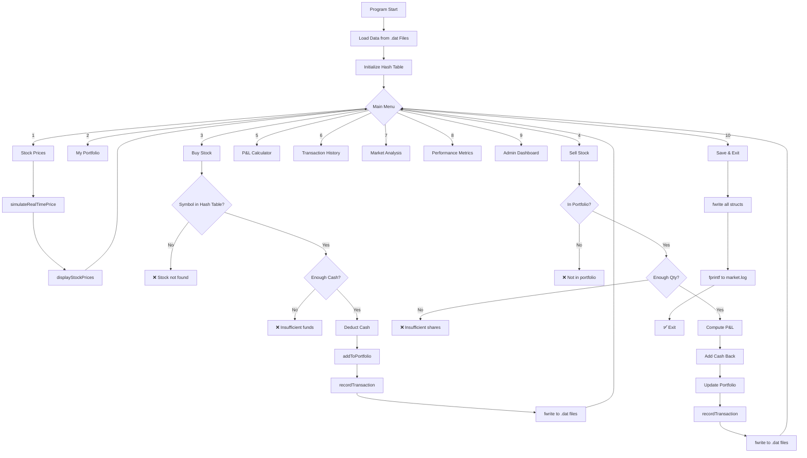

<div align="center">

# 📈 Stock Market Simulator with Portfolio Tracker

### *A Real-Time Stock Trading Simulation System in C*

[](https://en.wikipedia.org/wiki/C_(programming_language))
[](https://github.com)
[](./LICENSE)
[](https://github.com/snehalathaArakkonam/stock-market-simulator-with-portfolio-tracker)
[](https://github.com)
[](https://github.com)
[](https://github.com)
[](https://github.com)

> **A full-featured console-based stock trading simulation system** built in pure C — featuring real-time price simulation, portfolio tracking, buy/sell trading, P&L calculations, hash-table-powered fast lookups, market analysis, and persistent binary file storage.

[📌 Project Overview](#-project-overview) • [🧠 How It Works](#-how-it-works) • [📐 Architecture](#-system-architecture) • [🚀 Getting Started](#-getting-started) • [📊 Modules](#-modules) • [🎮 Sample I/O](#-sample-io--demo) • [📁 File Structure](#-file-structure)

</div>

---

## 📌 Project Overview

**Stock Market Simulator** is a **console-based C application** that replicates the behavior of a real stock market — without requiring any internet connection, real money, or external APIs. It simulates price movements, portfolio management, buy/sell trading, profit & loss analysis, and market trend reporting — all from your terminal.

This project was built to demonstrate mastery of:

| Concept | Implementation |
|---|---|
| **Hash Tables** | Symbol → Stock mapping (O(1) average lookup) |
| **File Handling** | Binary `.dat` files for persistent data storage |
| **Structures** | `Stock`, `Portfolio`, `Transaction`, `User` structs |
| **Mathematical Algorithms** | P&L %, ROI, Market Cap, Volatility |
| **Dynamic I/O** | Console menus, input validation, error handling |
| **Modular C** | 9 separate `.c` modules + header |
| **Simulation Logic** | ±5% random price fluctuations per tick |

---

## 🧠 How It Works

### The Big Picture

```
User Launches Program
        │
        ▼
┌─────────────────────────────────┐
│        MAIN MENU (loop)         │
│  1. Stock Prices                │
│  2. My Portfolio                │
│  3. Buy Stock      ──────────►  │──► Hash Table Lookup (O(1))
│  4. Sell Stock                  │──► Portfolio Update
│  5. P&L Calculator              │──► Binary File Write
│  6. Transaction History         │
│  7. Market Analysis             │
│  8. Performance Metrics         │
│  9. Admin Dashboard             │
│  10. Exit + Save                │
└─────────────────────────────────┘
        │
        ▼
  All data persists in .dat files
```

### Step-by-Step Flow

**1. Program Starts**
- Loads stock data from `stocks.dat` (or seeds defaults if file not found)
- Loads portfolio from `portfolio.dat`
- Loads transaction history from `transactions.dat`
- Initializes hash table (`symbolHash[1000]`) for fast stock lookups

**2. Stock Price Simulation**
- Every time the user selects "Real-Time Prices", a simulation tick runs
- Each stock's price changes by a random ±5% (`rand()` with seed)
- Trend is classified: `B` (Bull) if +2%↑, `H` (Bear) if -2%↓, `S` (Sideways) otherwise
- High/Low for the day are updated

**3. Buying a Stock**
- User enters stock symbol → Hash table locates it in O(1) time
- System validates: Does stock exist? Is quantity valid? Does user have enough cash?
- Deducts `price × quantity` from `user.availableCash`
- Adds entry to `portfolio.items[]`
- Records transaction in `TransactionList`
- Writes updated data to binary files

**4. Selling a Stock**
- Symbol lookup via hash → finds stock in portfolio
- Validates quantity ≤ holdings
- Calculates P&L: `(sellPrice - avgBuyPrice) × quantity`
- Adds sale amount back to `user.availableCash`
- Updates or removes portfolio item
- Records SELL transaction

**5. P&L Calculation**
```
totalProfitLoss  = totalCurrentValue - totalInvested
roi              = (totalProfitLoss / totalInvested) × 100
profitLoss%      = (profitLoss / (avgBuyPrice × qty)) × 100
```
- If ROI ≥ 10% → 🎯 TARGET GAIN ALERT triggers

**6. Data Persistence**
- On every buy/sell, data is written to binary files using `fwrite()`
- On startup, data is loaded using `fread()`
- `market.log` records timestamped activity as a text log

---

## 📐 System Architecture

```
stock_market_simulator/
│
├── stock_market.c          ← MAIN FILE (entry point, menu loop)
├── stock_module.c          ← Stock management + hash table
├── portfolio_module.c      ← Portfolio CRUD + valuation
├── trading_module.c        ← Buy/Sell logic
├── pnl_module.c            ← P&L + ROI calculator
├── transaction_module.c    ← Transaction history
├── analysis_module.c       ← Market analysis + diversification
├── metrics_module.c        ← Performance metrics + volatility
├── admin_module.c          ← Admin dashboard
│
├── stocks.dat              ← Binary: stock database
├── portfolio.dat           ← Binary: portfolio data
├── transactions.dat        ← Binary: transaction records
├── users.dat               ← Binary: user account info
├── market.log              ← Text: timestamped activity log
│
├── Makefile                ← Build automation
└── README.md               ← This file
```

---

## 🔬 Data Structures Deep Dive

### Stock Structure
```c
typedef struct Stock {
    char symbol[15];           // e.g., "RELIANCE"
    char companyName[100];     // e.g., "Reliance Industries"
    char sector[30];           // e.g., "Energy"
    float currentPrice;        // Live simulated price
    float openPrice;           // Day open
    float highPrice;           // Day high
    float lowPrice;            // Day low
    float previousClose;       // Previous close
    int   volume;              // Total shares available
    float marketCap;           // Calculated: price × volume
    float peRatio;             // Price-to-Earnings ratio
    float dividendYield;       // Dividend %
    char  trend;               // 'B' Bull | 'S' Sideways | 'H' Bear
    int   priceChange;         // Absolute change
    float priceChangePercent;  // Percentage change
} Stock;
```

### StockDatabase (with Hash Table)
```c
typedef struct StockDatabase {
    Stock stocks[100];          // All 100 stocks
    int   count;                // Active stock count
    int   symbolHash[1000];     // Hash table: symbol → index
} StockDatabase;
```

### Hash Table Logic (Fast Lookup)
```c
// Hash function: sum of ASCII values % 1000
int hashSymbol(char symbol[]) {
    int hash = 0;
    for(int i = 0; i < strlen(symbol); i++)
        hash += symbol[i];
    return hash % 1000;
}

// Lookup: O(1) average, O(n) worst case with linear probe fallback
Stock* searchBySymbol(StockDatabase* db, char symbol[]) {
    int hashValue = hashSymbol(symbol);
    int stockIndex = db->symbolHash[hashValue];
    if(stockIndex != -1 && strcmp(db->stocks[stockIndex].symbol, symbol) == 0)
        return &db->stocks[stockIndex];
    // Linear fallback for collision
    for(int i = 0; i < db->count; i++)
        if(strcmp(db->stocks[i].symbol, symbol) == 0)
            return &db->stocks[i];
    return NULL;
}
```

### Portfolio Structures
```c
typedef struct PortfolioItem {
    char  symbol[15];
    char  companyName[100];
    int   quantity;
    float avgBuyPrice;
    float currentPrice;
    float currentValue;
    float profitLoss;
    float profitLossPercent;
} PortfolioItem;

typedef struct Portfolio {
    PortfolioItem items[50];
    int   itemCount;
    float totalInvested;
    float totalCurrentValue;
    float totalProfitLoss;
    float totalProfitLossPercent;
    float roi;
} Portfolio;
```

### Transaction Structure
```c
typedef struct Transaction {
    int   transactionID;
    int   userID;
    char  symbol[15];
    char  type[10];       // "BUY" or "SELL"
    int   quantity;
    float price;
    float total;
    float profitLoss;
    long  transactionDate; // Unix timestamp
} Transaction;
```

### User Structure
```c
typedef struct User {
    int   userID;
    char  name[50];
    char  email[50];
    char  phone[15];
    float availableCash;        // Starting: ₹1,00,000
    float totalPortfolioValue;
} User;
```

---

## 📊 Modules

### Module 1 — Stock Management (`stock_module.c`)

| Function | Description |
|---|---|
| `addStock()` | Add a new stock to the database |
| `displayAllStocks()` | Print all stocks in table format |
| `searchStock()` | Search by name or symbol |
| `searchBySymbol()` | O(1) hash table lookup |
| `updateStockPrice()` | Manually update a stock's price |
| `sectorStocks()` | Filter stocks by sector |
| `topGainers()` | Top 5 stocks with highest % gain |
| `topLosers()` | Top 5 stocks with highest % loss |
| `simulateRealTimePrice()` | Simulate ±5% random price changes |
| `displayStockPrices()` | Formatted table with trend indicators |

### Module 2 — Portfolio Tracker (`portfolio_module.c`)

| Function | Description |
|---|---|
| `createPortfolio()` | Initialize a new portfolio |
| `addToPortfolio()` | Add/update stock in holdings |
| `displayPortfolio()` | Full portfolio table with P&L per item |
| `portfolioValue()` | Recalculate current total value |
| `calculateROI()` | Compute return on investment |
| `diversificationCheck()` | Sector allocation analysis |

### Module 3 — Trading (`trading_module.c`)

| Function | Description |
|---|---|
| `buyStock()` | Full buy flow with cash validation |
| `sellStock()` | Full sell flow with quantity validation |

### Module 4 — P&L Calculator (`pnl_module.c`)

| Function | Description |
|---|---|
| `calculateProfitLoss()` | Summary P&L statement |
| `topPortfolioGainers()` | Top winning stocks in portfolio |
| `topPortfolioLosers()` | Top losing stocks in portfolio |

### Module 5 — Transaction History (`transaction_module.c`)

| Function | Description |
|---|---|
| `recordTransaction()` | Log buy/sell with timestamp |
| `displayTransactions()` | Full transaction ledger |
| `searchTransactions()` | Filter by stock symbol |
| `dailyTransactions()` | Today's activity |

### Module 6 — Market Analysis (`analysis_module.c`)

| Function | Description |
|---|---|
| `marketAnalysis()` | Bull/Bear/Sideways sentiment report |
| `diversificationCheck()` | Sector % breakdown of portfolio |

### Module 7 — Performance Metrics (`metrics_module.c`)

| Function | Description |
|---|---|
| `performanceMetrics()` | ROI, volatility, risk level, recommendation |

### Module 8 — Admin Dashboard (`admin_module.c`)

| Function | Description |
|---|---|
| `adminDashboard()` | Total users, transactions, portfolio value, P&L, market cap |

---

## 🗄️ File Handling

### Binary Files (`.dat`)

| File | Contents | Mode |
|---|---|---|
| `stocks.dat` | Full `Stock` struct array | `rb+` / `wb+` |
| `portfolio.dat` | Full `Portfolio` struct | `rb+` / `wb+` |
| `transactions.dat` | `Transaction` array | `ab+` / `rb+` |
| `users.dat` | `User` struct | `rb+` / `wb+` |

### Text Log

| File | Contents |
|---|---|
| `market.log` | Timestamped activity: buys, sells, logins, errors |

### File Operations Used
```c
fopen()    // Open with mode rb+, wb+, ab+
fwrite()   // Write structs as binary
fread()    // Read structs from binary
fprintf()  // Write to market.log
fclose()   // Always close after operation
// Error: if fopen() returns NULL → auto-create the file
```

---

## 🚀 Getting Started

### Prerequisites
```bash
# Linux / macOS
gcc --version     # GCC 9+ recommended
make --version    # GNU Make

# Windows
# Use MinGW or WSL
```

### Installation & Build
```bash
# 1. Clone the repository
git clone https://github.com/snehalathaArakkonam/stock-market-simulator-with-portfolio-tracker.git
cd stock-market-simulator-with-portfolio-tracker

# 2. Build with Makefile
make

# 3. Run
./stock_market
```

### Manual Compile (no Make)
```bash
gcc -o stock_market stock_market.c stock_module.c portfolio_module.c \
    trading_module.c pnl_module.c transaction_module.c \
    analysis_module.c metrics_module.c admin_module.c -lm

./stock_market
```

---

## 🎮 Sample I/O — Demo

### ▶ Program Start

```
========================================
    STOCK MARKET SIMULATOR
    Portfolio Tracker & Trading
========================================
1.  Stock Market Prices
2.  My Portfolio
3.  Buy Stock
4.  Sell Stock
5.  Profit & Loss
6.  Transaction History
7.  Market Analysis
8.  Performance Metrics
9.  Admin Dashboard
10. Exit
========================================
Enter choice: 
```

---

### ▶ Option 1 — Stock Market Prices

**Input:** `1`

**Output:**
```
========================================
    STOCK MARKET PRICES
========================================

SYMBOL    | COMPANY              | PRICE      | CHANGE    | TREND
----------|----------------------|------------|-----------|-------
RELIANCE  | Reliance Industries  | ₹2512.50  | +0.50%   | 🟢 BULL
TCS       | Tata Consultancy     | ₹3482.50  | -0.50%   | 🔴 BEAR
INFY      | Infosys              | ₹1520.00  | +1.20%   | 🟢 BULL
HDFC      | HDFC Bank            | ₹1680.00  | -0.80%   | 🔴 BEAR
WIPRO     | Wipro Ltd            | ₹410.50   | +0.10%   | 🟡 SIDE

========================================
```

---

### ▶ Option 3 — Buy Stock

**Input:**
```
Enter choice: 3

=== BUY STOCK ===
Enter Stock Symbol: RELIANCE

Stock Details:
 Company: Reliance Industries
 Current Price: ₹2500.00
 Available: 10000 shares

Quantity: 10
```

**Output:**
```
✅ Stock purchased successfully!
 Symbol: RELIANCE
 Quantity: 10
 Price: ₹2500.00
 Total: ₹25,000.00
 Remaining Cash: ₹75,000.00
```

---

### ▶ Option 2 — My Portfolio

**Input:** `2`

**Output:**
```
========================================
    PORTFOLIO TRACKER
========================================

SYMBOL    | COMPANY          | QTY  | AVG PRICE  | CURRENT   | P&L       | P&L%
----------|------------------|------|------------|-----------|-----------|--------
RELIANCE  | Reliance Ind.    |  10  | ₹2500.00  | ₹2512.50 | ₹125.00  | +0.50%
TCS       | Tata Consultancy |   5  | ₹3500.00  | ₹3482.50 | ₹-87.50  | -0.25%

========================================
Total Invested:  ₹42,500.00
Current Value:   ₹42,537.50
Total P&L:       ₹37.50
Total P&L %:     +0.09%
ROI:             +0.09%
========================================
```

---

### ▶ Option 4 — Sell Stock

**Input:**
```
Enter choice: 4

=== SELL STOCK ===
Enter Stock Symbol: RELIANCE

Quantity: 5
```

**Output:**
```
✅ Stock sold successfully!
 Symbol: RELIANCE
 Quantity: 5
 Price: ₹2512.50
 Total: ₹12,562.50
 P&L: ₹62.50
 Available Cash: ₹70,062.50
```

---

### ▶ Option 5 — Profit & Loss Calculator

**Input:** `5`

**Output:**
```
========================================
    PROFIT & LOSS CALCULATOR
========================================

Total Invested:  ₹37,500.00
Current Value:   ₹37,512.50

Total P&L:       ₹12.50
Total P&L %:     +0.03% 🟢

ROI: +0.03%
========================================
```

**If target met (ROI ≥ 10%):**
```
🎯 TARGET MET! Portfolio gained 10%+
Congratulations! Your portfolio is up +12.50%
```

---

### ▶ Option 7 — Market Analysis

**Input:** `7`

**Output:**
```
========================================
    MARKET ANALYSIS & TRENDS
========================================

Market Sentiment: 🟡 NEUTRAL 🟡

Bull Markets: 15
Bear Markets: 12
Sideways:     10
Average Change: +0.25%
========================================
```

---

### ▶ Option 8 — Performance Metrics

**Input:** `8`

**Output:**
```
========================================
    PORTFOLIO PERFORMANCE METRICS
========================================

Total Invested:  ₹37,500.00
Current Value:   ₹37,512.50
Total P&L:       ₹12.50
ROI:             +0.03%
Volatility:      5.00%

Risk Level: MODERATE 🟡

Recommendation: 🟡 HOLD - Moderate performance, monitor closely
========================================
```

---

### ▶ Option 9 — Admin Dashboard

**Input:** `9`

**Output:**
```
========================================
    ADMIN DASHBOARD
========================================

Total Users:           100
Total Transactions:    1,500
Total Portfolio Value: ₹5,00,00,000
Total P&L:             ₹25,00,000
Market Cap:            ₹1,00,00,00,000
Active Traders:        75

Top Stocks by Market Cap:
1. RELIANCE  - ₹25,12,50,000
2. TCS       - ₹17,41,25,000
3. INFY      - ₹15,20,00,000
========================================
```

---

### ▶ Option 10 — Exit

```
Stock data saved successfully!
Thank you for using Stock Market Simulator!
```

---

## 🔢 Mathematical Formulas Used

```
P&L per Stock    = (currentPrice - avgBuyPrice) × quantity
P&L %            = (P&L / (avgBuyPrice × quantity)) × 100
Total P&L        = Σ (P&L of all portfolio items)
ROI              = (totalProfitLoss / totalInvested) × 100
Current Value    = Σ (currentPrice × quantity) per item
Market Cap       = currentPrice × volume
Price Change %   = ((currentPrice - previousClose) / previousClose) × 100
Simulated Change = currentPrice × (rand() % 101 - 50) / 1000.0   [±5%]
```

---

## ⚠️ Input Validation Rules

| Input | Validation |
|---|---|
| Stock Symbol | Must exist in database (hash lookup) |
| Buy Quantity | Must be > 0 and ≤ available volume |
| Sell Quantity | Must be > 0 and ≤ portfolio holdings |
| Cash Check | `totalCost > user.availableCash` → reject |
| Menu Choice | Must be 1–10; invalid shows error, re-prompts |
| File Open | If `fopen()` returns NULL → auto-create file |
| Empty Portfolio | Sell attempt on empty portfolio → error message |

---

## 🗺️ System Flow Diagram



---

## 📁 File Structure

```
stock-market-simulator-with-portfolio-tracker/
│
├── 📄 stock_market.c          ← Main file (800+ lines)
├── 📄 stock_module.c          ← Stock functions (200 lines)
├── 📄 portfolio_module.c      ← Portfolio functions (220 lines)
├── 📄 trading_module.c        ← Buy/Sell functions (180 lines)
├── 📄 pnl_module.c            ← P&L calculator (160 lines)
├── 📄 transaction_module.c    ← Transaction functions (140 lines)
├── 📄 analysis_module.c       ← Market analysis (160 lines)
├── 📄 metrics_module.c        ← Performance metrics (140 lines)
├── 📄 admin_module.c          ← Dashboard (120 lines)
│
├── 🗄️  stocks.dat              ← Binary stock database
├── 🗄️  portfolio.dat           ← Binary portfolio data
├── 🗄️  transactions.dat        ← Binary transaction records
├── 🗄️  users.dat               ← Binary user data
├── 📝 market.log              ← Text activity log
│
├── 🔧 Makefile                ← Build automation
├── 📄 .gitignore
├── 📄 LICENSE
└── 📄 README.md
```

---

## 🧩 Key Concepts Demonstrated

```
✅ Hash Tables          → Symbol-to-stock O(1) lookup (symbolHash[1000])
✅ File Handling        → fwrite/fread binary structs; fprintf text log
✅ Structures           → Stock, Portfolio, Transaction, User, StockDatabase
✅ Dynamic Allocation   → Malloc for transaction history expansion
✅ Mathematical Algo    → P&L %, ROI, volatility, market cap
✅ Input Validation     → Every scanf input is range/type/logic checked
✅ Modular Design       → 9 separate .c files with clear responsibilities
✅ Simulation Engine    → rand()-based ±5% price changes per tick
✅ Trend Classification → Bull/Sideways/Bear per price change threshold
✅ Admin Analytics      → Aggregated dashboard from all data files
```

---

## 👩‍💻 Author

<div align="center">

**Snehalatha Arakkonam**
*B.Tech CSE — AI & ML Specialization*

[](https://github.com/snehalathaArakkonam)

</div>

---

<div align="center">

*📈 Built with pure C — No APIs. No GUI. No real money. Just clean systems programming.*

</div>
